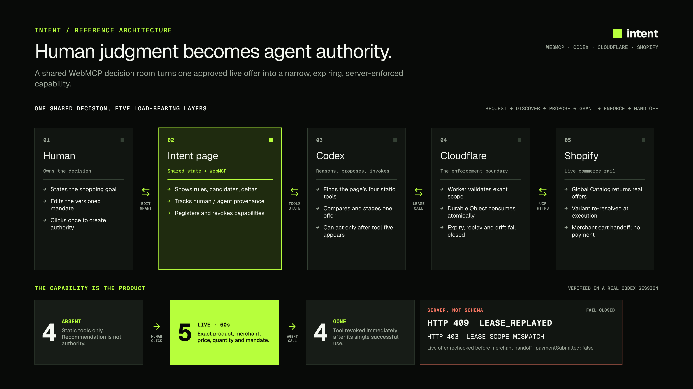

  

<h1 align="center">Intent</h1>

<strong>Your agent shops. You call the shots.</strong>

One human-approved checkout capability. Exact scope. One use.

  <a href="https://intent-commerce.gowtham0992.chatgpt.site/intent">Live product on ChatGPT Sites</a>
  ·
  <a href="#try-the-live-product">Try it</a>
  ·
  <a href="#architecture">Architecture</a>
  ·
  <a href="#run-locally">Run locally</a>
  ·
  <a href="LICENSE">MIT license</a>

> Agents can already find products. Intent answers the harder question: **what exactly did the person authorize?**

Intent is a shared WebMCP decision room for consequential agent actions. An agent searches live offers and stages a recommendation. A person edits the rules and approves one exact proposal. Only then does the page create a 60-second, single-use checkout capability in the agent's tool list.

The Cloudflare backend atomically consumes that authority and revalidates the live Shopify offer before returning a merchant cart URL. Replay, scope widening, price drift, unavailability, and mandate violations fail closed. Intent never accepts payment credentials or submits payment.

The decision context can also survive a refresh without carrying authority across it: Intent restores the validated mandate and bounded collaboration history, re-fetches live offers, and keeps proposals, leases, and the checkout capability absent.

## Why Intent exists

A normal agent confirmation is a moment in a conversation. It is not an enforceable object: it does not define an exact scope, expire, prevent replay, or verify that execution still matched the approved offer.

Intent turns the decision into a capability with observable boundaries:

| Before approval | After approval | After execution or expiry |
| --- | --- | --- |
| Four non-checkout tools | One exact checkout tool appears | The checkout tool disappears |
| Recommendation only | Frozen to one offer and one use | Replay is rejected server-side |
| No cart authority exists | Live for at most 60 seconds | No ambient authority remains |

The result is not another shopping assistant. It is a working reference product for websites and agent platforms that need human decisions converted into narrow, expiring, server-enforced capabilities. Every lifecycle transition also carries a stable reason code, responsible actor, mandate version, and next step, so disappearance is explainable rather than ambiguous.

## What the human and agent do together

| Participant | Responsibility |
| --- | --- |
| Agent | Interprets the request, compares merchant-provided evidence against product-fit requirements, and stages one recommendation |
| Human | Reviews the same decision room, changes the mandate, and explicitly grants one-use authority |
| Intent | Keeps both sides on the same mandate version, applies deterministic price and reputation rules, records provenance, exposes the exact capability, and enforces it at execution |

Neither participant can finish the flow alone. The agent cannot create its own authority. The person cannot grant authority until the agent stages an eligible offer under the current mandate version. If the person changes a rule, the version increments and the old proposal becomes invalid.

## Try the live product

No account, credentials, store, Shopify token, or seeded catalog is required.

1. Open [Intent](https://intent-commerce.gowtham0992.chatgpt.site/intent) in ChatGPT's in-app browser or another WebMCP-enabled client.
2. Give the agent this test request:

   > Use Intent to find a charger available in the US under $100, with at least 100W total output, three ports including two USB-C ports, foldable US prongs, a rating of at least 4.5, and at least 200 reviews. Stage the strongest eligible offer for approval. Do not purchase anything.

3. Confirm that the agent opens the shared room, compares live offers, and stages one candidate while checkout authority remains absent.
4. Optionally refresh before approval. Confirm that Intent restores the mandate, revalidates fresh live offers, and still exposes no checkout capability.
5. Optionally edit the mandate and ask the agent to read the latest version and stage again.
6. Click **Grant one-use authority** on the page.
7. Watch the pending staging call resume automatically. The agent discovers and invokes the newly available checkout tool in the same turn; no follow-up chat message is required.
8. Confirm that the merchant cart handoff is returned, <code>paymentSubmitted</code> is <code>false</code>, and the tool disappears.

The observable lifecycle is:

~~~text
4 tools → human approval → 5 tools → one exact execution → 4 tools
~~~

Reusing the consumed lease returns <code>409 LEASE_REPLAYED</code>. Trying to alter its approved fields returns <code>403 LEASE_SCOPE_MISMATCH</code>.

### Optional Codex routing plugin

The page publishes its own WebMCP tools; the plugin is not required after a client reaches the site. It makes an ordinary shopping request route to Intent automatically:

~~~bash
codex plugin marketplace add gowtham0992/intent --ref main
codex plugin add intent@intent
~~~

Start a new Codex task and ask:

> Find me a reliable 65W USB-C charger for my MacBook under $60.

The plugin opens Intent and then yields to the page-defined WebMCP workflow. It cannot choose an offer, approve a proposal, or grant itself checkout authority.

## Why WebMCP is load-bearing

Intent uses WebMCP as a runtime authority surface, not merely as a structured copy of the visible UI:

- **Progressive discovery:** the four collaboration tools register when the agent visits the page; no site-specific API integration is required.
- **Shared state:** the agent reads and mutates the same versioned decision artifact the person sees.
- **Visible provenance:** agent-authored ledger entries name the WebMCP tool that produced them, while human and system events remain visually distinct.
- **Agent-only actions:** comparison matrices, proposal staging, and checkout invocation are structured agent operations rather than duplicated buttons.
- **Dynamic authority:** the checkout tool is registered only after a human click. On success, scope is consumed immediately and registration is revoked after the result settles; cancellation, failure, and expiry revoke it immediately.
- **Explainable disappearance:** the permanent read tool reports why checkout authority is absent, who owns the next step, and the bounded transition history—even after the temporary tool is gone.
- **Safe resumption:** validated mandate context can survive a refresh, but Intent re-queries UCP and never restores an offer, staged proposal, lease, or dynamic checkout capability.
- **Inspectable scope:** every field in the temporary tool's input schema is frozen to a single allowed value.
- **Independent enforcement:** the schema communicates the contract, while the Worker and Durable Object enforce it against live external state.
- **Untrusted-data signaling:** every tool that can return merchant-controlled catalog content sets WebMCP's <code>untrustedContentHint</code> so capable clients can apply heightened handling.
- **Verifiable mutations:** mutating tools return a canonical mandate version, authority state, and reason alongside their primary result.

Without WebMCP, Intent would be a shopping page with a guarded checkout button. With WebMCP, the page can change what the visiting agent is capable of doing during the session.

The registration lifecycle is implemented in [app.js](app.js), and server enforcement lives in [cloudflare/commerce-worker.mjs](cloudflare/commerce-worker.mjs).

## Architecture

| Layer | Role |
| --- | --- |
| Human | Owns the goal, edits the mandate, and creates authority with an explicit click |
| Intent on ChatGPT Sites | Hosts the decision room, deterministic evaluation, provenance, and page-defined WebMCP tools |
| WebMCP client | Reasons over candidates, stages a recommendation, and invokes only capabilities currently exposed by the page |
| Cloudflare Worker + Durable Object | Validates input, issues the opaque lease, consumes it atomically, and enforces expiry and exact scope |
| Shopify Global Catalog/UCP | Supplies live cross-merchant offers and merchant checkout handoffs |

WebMCP is the agent-to-page interface. UCP is the commerce interoperability rail. Intent is the human-visible authority boundary between them.

## WebMCP tools

| Tool | Availability | Effect |
| --- | --- | --- |
| <code>intent_propose_purchase_mandate</code> | Page load | Creates the mandate, searches live UCP offers, and opens the decision room |
| <code>intent_compare_candidates</code> | Page load | Returns every deterministic check and numeric delta for every candidate |
| <code>intent_read_purchase_mandate</code> | Page load | Reads the current mandate, proposal, provenance, safe-resume status, and reason-coded capability lifecycle |
| <code>intent_stage_candidate_for_approval</code> | Page load | Stages one eligible offer, opens human review, and waits so a grant can resume the same agent turn |
| <code>intent_open_approved_checkout_once</code> | Human-granted for at most 60 seconds | Revalidates and returns one exact merchant checkout, then disappears |

The first four tools cannot create a cart or grant authority. The fifth tool does not exist until the person approves the staged proposal.

## Enforcement guarantees

- Search input and UCP catalog responses are validated.
- Search and checkout revalidation both require Shopify's live <code>ships_to</code> eligibility for the exact destination country.
- Prices remain integer minor units; the current mandate supports USD evidence.
- Missing rating or review evidence fails closed when the mandate requires it.
- Product, variant, seller, image, and checkout URLs are validated.
- The checkout host must match the seller host or Shopify's checkout host.
- Quantity is fixed to one.
- The exact variant is resolved again immediately before handoff.
- Price drift, unavailability, identity changes, and mandate violations fail closed.
- A Durable Object transaction makes lease consumption atomic.
- Replay and scope widening are rejected by the server.
- Authority expires after one use or 60 seconds.
- Live shopping responses use <code>Cache-Control: no-store</code>.
- Payment credentials never enter Intent and payment is never submitted.

## Run locally

### Prerequisites

- Node.js 20 or later
- Network access to Shopify's Global Catalog
- A WebMCP-enabled client to exercise the agent tools; the page still renders in a normal browser

Install the pinned toolchain, verify the repository, and start both local services:

~~~bash
git clone https://github.com/gowtham0992/intent.git
cd intent
npm ci
npm run check
npm run dev
~~~

Open [http://127.0.0.1:4310](http://127.0.0.1:4310). The command starts the static application on port <code>4310</code> and a local commerce gateway on port <code>4312</code>. Those two runtime processes use Node built-ins; the installed packages reproduce the Sites, Cloudflare, and evaluation toolchain.

The local gateway calls the real Shopify Global Catalog and advertises the deployed public UCP profile. It does not substitute fixtures when the upstream service fails. For local development it provides an in-memory Durable Object adapter with the same atomic one-use behavior; its leases intentionally disappear when the development server restarts.

~~~bash
npm run dev     # run the local page and commerce gateway
npm run test    # run the Node test suite
npm run check   # syntax checks plus the full test suite
npm run build   # create the static dist/ output
~~~

The suite currently contains 50 top-level tests, including a 14-case boundary matrix, reason-coded lifecycle transitions, mandate-version invalidation, safe-resume isolation, destination enforcement, Chrome-safe dynamic-tool teardown, atomic replay rejection, scope-widening rejection, live price revalidation, untrusted-output signaling, mutation read-backs, agent-evaluation contract validation, tool provenance validation, and production configuration checks.

## Deploy your own instance

Intent's production app origins must be explicitly allowlisted by the enforcement service:

~~~text
APP_ORIGIN             = https://your-intent-app.example
OPTIONAL_FALLBACK      = https://your-fallback-app.example
WORKER_ORIGIN          = https://your-intent-worker.example
~~~

Use origins only: include the scheme, do not add a path, and do not leave a trailing slash.

### 1. Deploy the Cloudflare enforcement service

Update <code>wrangler.commerce.jsonc</code>:

- choose a unique Worker <code>name</code>;
- set <code>MERCHANT_ORIGIN</code> to <code>APP_ORIGIN</code>;
- optionally set <code>ADDITIONAL_MERCHANT_ORIGIN</code> to one exact fallback origin;
- set <code>UCP_AGENT_PROFILE_URL</code> to <code>WORKER_ORIGIN/.well-known/ucp</code>.

~~~bash
npx wrangler@latest login
npx wrangler@latest deploy --config wrangler.commerce.jsonc
~~~

The first deployment applies migration <code>v1</code> and creates the SQLite-backed <code>PurchaseLease</code> Durable Object class. If Wrangler returns a different Worker origin, update <code>UCP_AGENT_PROFILE_URL</code> and use that exact origin everywhere below.

Verify the public UCP profile:

~~~bash
curl https://your-intent-worker.example/.well-known/ucp
~~~

The response should advertise <code>dev.ucp.shopping.catalog.search</code>, <code>dev.ucp.shopping.catalog.lookup</code>, and <code>dev.shopify.catalog.global</code>.

### 2. Deploy the decision room

The canonical Intent deployment uses ChatGPT Sites. The repository already contains the Sites project metadata and Vinext adapter. For a new fork, create or select a Sites project, replace the <code>project_id</code> in <code>.openai/hosting.json</code>, then build from the repository root with the exact Worker origin:

~~~bash
npm ci
INTENT_COMMERCE_ORIGIN=https://your-intent-worker.example npm run build:sites
~~~

Publish the resulting Sites build through ChatGPT Sites. Keep only the Sites project identifier and optional supported resource bindings in <code>.openai/hosting.json</code>; do not commit deployment credentials or secrets. After Sites gives you the final application origin, set that exact origin as <code>MERCHANT_ORIGIN</code> in <code>wrangler.commerce.jsonc</code> and redeploy the Worker.

A fork can instead use Vercel or another static host that serves the built assets with the required security headers. The included Vercel configuration is a ready-to-run fallback deployment.

#### Vercel fallback

Replace the current Worker origin in <code>vercel.json</code> under the Content Security Policy's <code>connect-src</code> directive.

~~~bash
npx vercel@latest login
npx vercel@latest link
npx vercel@latest env add INTENT_COMMERCE_ORIGIN production
npx vercel@latest env add INTENT_COMMERCE_ORIGIN preview
npx vercel@latest deploy --prod
~~~

Enter the exact <code>WORKER_ORIGIN</code> when prompted for <code>INTENT_COMMERCE_ORIGIN</code>. The production build refuses a missing or malformed commerce origin.

If a host returns a different application origin, update the exact allowlist in <code>wrangler.commerce.jsonc</code> and deploy the Worker again. Unrelated preview domains cannot call the commerce endpoints.

### 3. Point a forked plugin at the deployment

For a published fork, replace the production URL and repository metadata in:

- <code>plugins/intent/skills/intent-shopping/SKILL.md</code>;
- <code>plugins/intent/.codex-plugin/plugin.json</code>.

Users can then add the fork as a Codex marketplace and install its Intent plugin.

### 4. Verify production

~~~bash
npm run check
INTENT_COMMERCE_ORIGIN=https://your-intent-worker.example npm run build
~~~

Exercise the [live workflow](#try-the-live-product) and verify:

1. Four tools exist before approval.
2. The agent can search, compare, and stage a live eligible offer.
3. A mandate edit invalidates the old proposal.
4. Human approval creates the frozen fifth tool.
5. One invocation returns an HTTPS merchant cart URL with <code>paymentSubmitted: false</code>.
6. The fifth tool disappears.
7. Replay and widened scope are rejected by the Worker.

### Agent-behavior evaluations

The deterministic test suite verifies policy and server enforcement. The separate WebMCP agent suites verify that a model selects the right tools, preserves the user's hard constraints, follows the required order, stops when no offer qualifies, and never treats an absent or consumed capability as permission.

The schemas used by the evaluator are generated from the same contracts registered by the production page, preventing the test surface from drifting away from the product. The evaluator is pinned as a development dependency; model credentials are used only by the evaluator and must stay in an uncommitted <code>.env</code> file.

Copy <code>.env.example</code> to <code>.env</code> and provide one supported provider key. The default is the high-volume Gemini Flash-Lite model through the Vercel AI SDK backend because that backend supports the suite's multi-step mocked trajectories. Set <code>WEBMCP_EVAL_MODEL</code> to override the model without changing the committed runner.

~~~bash
npm run eval:agent
npm run eval:authority
~~~

Both commands write console, HTML, and JSON reports under the ignored <code>.evals/</code> directory. A wrapper converts evaluator errors and behavioral mismatches into a non-zero exit code so these commands are safe to use as CI gates. The pre-approval command paces cases for Gemini's free-tier request window; paid or local backends can override this with <code>WEBMCP_EVAL_PACE_MS=0</code>. It uses controlled catalog outputs to test probabilistic tool choice without touching commerce. The granted-state suite uses a clearly synthetic frozen lease. Neither suite bypasses the product's real human approval gate.

## Repository map

~~~text
app.js                          page state, WebMCP registration, capability lifecycle
cloudflare/commerce-worker.mjs UCP gateway, validation, lease issuance and consumption
lib/                            mandate, evaluation, safe resume, capability ledger, tool lifecycle, activity and staging logic
plugins/intent/                 optional Codex routing plugin
tests/                          policy, lifecycle, deployment and boundary tests
evals/                          WebMCP agent trajectories and generated lifecycle schemas
assets/                         Intent brand and reference architecture
scripts/build.mjs               static production build and exact-origin injection
server.mjs                      dependency-free local development servers
~~~

## Current boundaries

Intent currently supports one physical item, USD mandate evidence, a 60-second lease, Shopify Global Catalog discovery, and merchant-cart handoff. Validated mandate context and bounded activity can resume for 24 hours in same-origin browser storage; offers are re-fetched live, while proposals, leases, and checkout authority never resume.

Natural-language product requirements—such as wattage, port count, material, or dimensions—are judgments the agent makes from untrusted merchant catalog evidence and displays for human review. Intent does not claim to independently verify those facts. The Worker enforces the deterministic authority boundary: exact product and variant, quantity, currency, price ceiling, destination eligibility, rating and review thresholds, lease expiry, single use, replay protection, and live offer consistency.

The origin allowlist is CSRF hygiene, not authentication. A human click gates authority in the page, but it is not cryptographic proof of human identity. The lifecycle ledger is page-asserted transparency, not remote attestation. Merchants do not currently consume or verify the Intent mandate, and an agent can bypass Intent by navigating directly to a public merchant cart. Intent demonstrates an opt-in enforceable execution path for WebMCP clients; it is not a universal commerce firewall.

Accounts, account-synced or cross-device mandates, multi-item checkout, payment execution, merchant-side mandate verification, and universal client compatibility are outside the current scope.

## License

[MIT](LICENSE)
